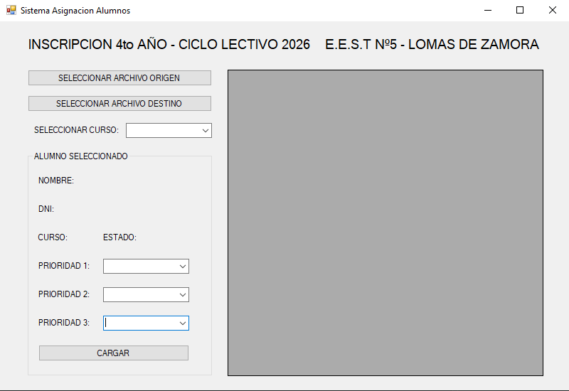
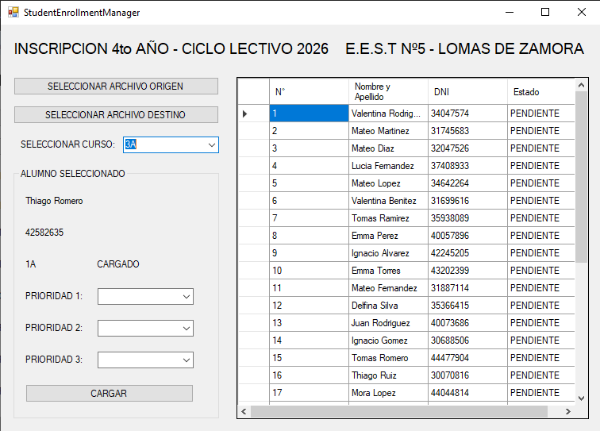

# Student Specialization Assignment System

This project is a C# application developed to manage the assignment of students to technical specializations in a technical school.

The system was created to automate the process of distributing students among different technical orientations based on their preferences, replacing a manual process that was previously done using spreadsheets.

## Context

This software was developed to be used in a technical school where students must choose between several technical specializations.  
The program processes those choices and automatically assigns each student to the corresponding course.

## Technologies Used

- C#
- Windows Forms
- ClosedXML
- Excel as data storage

## Features

- Read student data from Excel files
- Manage student information using linked lists
- Process specialization preferences
- Automatically assign students to courses
- Generate Excel files with the final assignments

## Project Structure

- `ALUMNO.cs`  
  Defines the student data structure.

- `LAL.cs`  
  Implementation of linked lists used to store and sort students.

- `Form1.cs`  
  Graphical interface and main application logic.

- Excel processing modules using ClosedXML.

## System Workflow

1. Student data is loaded from an Excel file.
2. Students are stored in linked lists.
3. The system processes specialization preferences.
4. Each student is assigned to the appropriate course.
5. A new Excel file with the final distribution is generated.

## Requirements

- Visual Studio
- .NET
- ClosedXML library

## Author

Developed as a practical solution to manage student specialization assignments in a technical school.

## Application Screenshots

### Main Window

### Initial Excel

### Data Load

### Resulting Excel

### Changes on the Initial Excel

